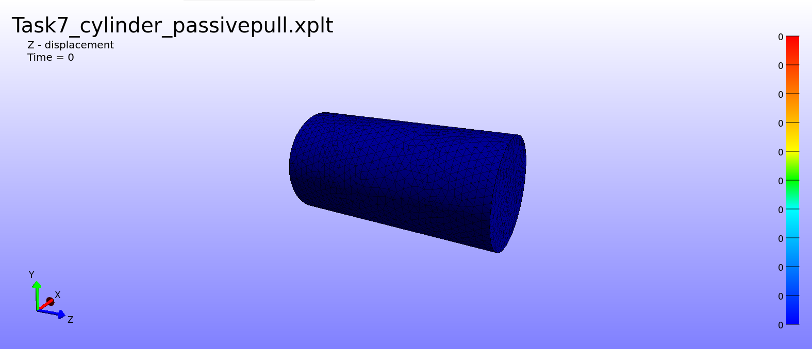
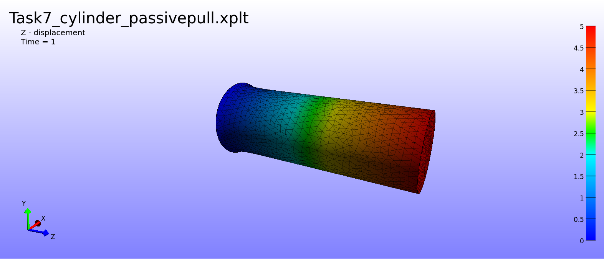
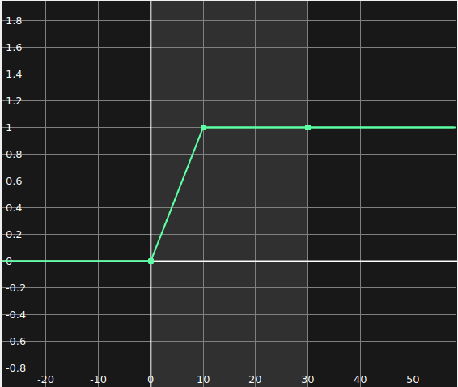
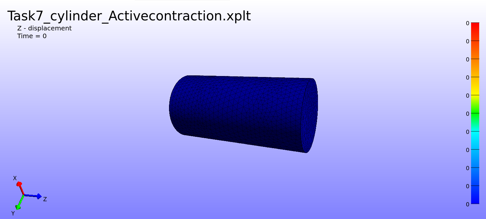
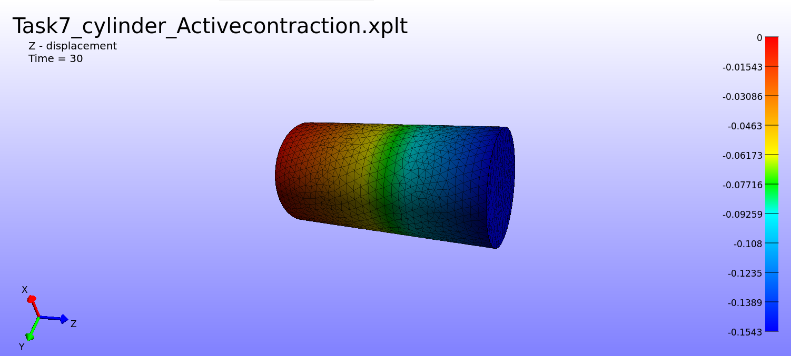

# Skeletal Muscle Cylinder Simulation (Validation Workflow)

## Overview
This directory contains the initial FEBioStudio simulation files for modeling a simple cylindrical representation of skeletal muscle tissue. The objective of this preliminary task is to establish and validate a stable finite element pipeline—from CAD geometry processing to passive tensile testing—before applying the workflow to the complex, assigned biological muscle geometry.

---

## Part 1: Geometry Processing and Volumetric Meshing
**Objective:** Convert a raw CAD surface shell into a dense, solid volumetric mesh suitable for hyperelastic finite element analysis.

A two-step surface-to-volume approach was utilized within FEBioStudio:
1. **Surface Shattering (MMG Remesh):** The outer shell was passed through the MMG Remesh tool (Element Size: 0.8) to artificially shatter the large CAD faces into a highly uniform boundary web (3,550 faces).
2. **Volumetric Packing (TetGen):** With surface constraints removed, TetGen successfully filled the interior volume using TET10 (Quadratic tetrahedra) elements to prevent "volumetric locking" in the incompressible material. This resulted in a dense core of 33,546 elements.

---

## Part 2: Passive Baseline Validation (The Pull Test)
**Objective:** Validate the finite element mesh, material parameters, and boundary conditions using a passive, 5mm prescribed displacement.

### Material Setup & Boundary Conditions
* An **Uncoupled Mooney-Rivlin** hyperelastic material was applied (c1 = 13.85, c2 = 0, k = 2500) to isolate the passive ground matrix and enforce strictly incompressible behavior.
* A static solid mechanics step was established (1.0s total).
* **Anchor:** Zero Displacement applied to the bottom face (X, Y, Z locked).
* **Pull:** Prescribed Displacement of 5mm along the Z-axis applied to the top face.

### Results
The simulation achieved **Normal Termination**. The **Z-displacement** color map demonstrates stable matrix math, with the expected structural "necking" to preserve volume during the 5mm stretch.

> **Initial State (t=0) - Z-Displacement:**
> 
>
> **Final Displaced State (t=1) - Z-Displacement:**
> 

---

## Part 3: Active Muscle Contraction (Validation Workflow)
**Objective:** Transition the passive model into an active biological system capable of generating internal force along a specified fiber vector. This phase validates the dynamic solver settings and the integration of complex physiological length-tension parameters.

### Material Setup & Boundary Conditions
* **Material Architecture:** The model was upgraded to a **Transversely Isotropic Mooney-Rivlin (Uncoupled)** material. This introduces a directional fiber component aligned with the long axis of the cylinder (Z-axis: 0, 0, 1) to mathematically represent skeletal muscle striations.
* **Passive Structural Parameters:** Utilizing established physiological baselines, the ground matrix and passive fibers were configured for stable dynamic compression (Density = 1, c1 = 13.85, k = 100, c3 = 2.07, c4 = 61.44, c5 = 640.7, lam_max = 1.03).
* **Active Contraction Parameters:** The internal force generation utilized a physiological length-tension active model (Tmax = 1, ca0 = 4.35, beta = 4.75, l0 = 1.58, refl = 2.04). 
* **The Activation Signal:** The master activation scale (`ascl`) was wired to a piecewise load curve (`LC1`), which smoothly ramped the electrical signal from 0 to 1 over the first 10 seconds, holding at maximum activation until the 30-second mark.
* **Boundary Conditions:** The prescribed pulling displacement from the previous task was deleted, leaving the top face completely unconstrained. The bottom face remained fully anchored (Zero Displacement in X, Y, Z).
* **Solver Configuration:** A **Dynamic** analysis step was employed (300 steps, 0.1s step size) using a Symmetric matrix. This was crucial to account for the physical mass and inertia of the tissue during active deformation.

### Results
The simulation achieved **Normal Termination**. The application of the active contraction equation successfully generated internal stress, causing the free end of the cylinder to forcefully pull itself inward along the Z-axis without the application of any external boundary forces. 

Because the dynamic solver calculates real-world inertia (Force = mass × acceleration), the tissue exhibited an undamped harmonic oscillation. As the contracting fibers rapidly compressed the passive ground matrix, the physical mass generated momentum, causing the model to slightly overshoot its equilibrium and rebound. This physical "bounce" over the 30-second duration successfully demonstrates the complex mechanical interplay between the active pulling forces and the structural stiffness of the passive matrix.

> **The Activation Signal - Load Curve (LC1):**
> 
>
> **Initial State (t=0) - Pre-Activation:**
> 
>
> **Final State (t=30) - Active Contraction:**
> 