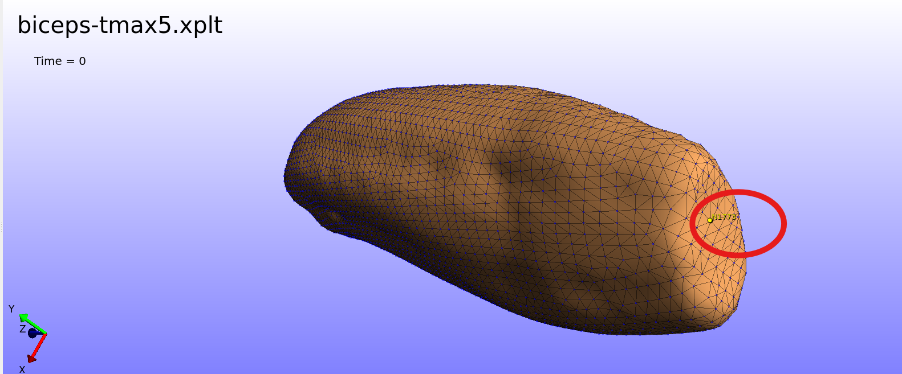
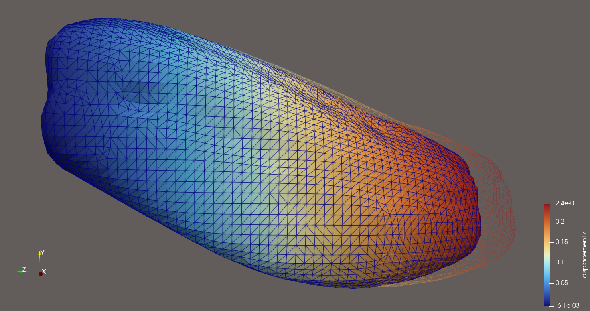
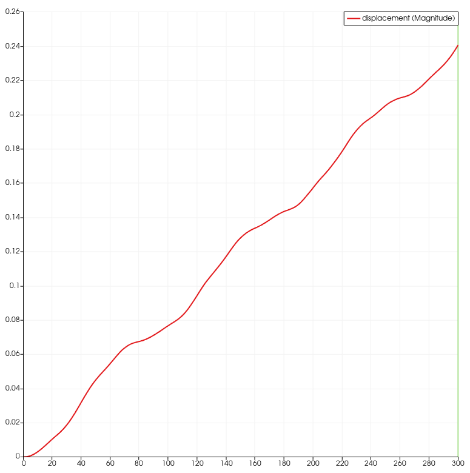
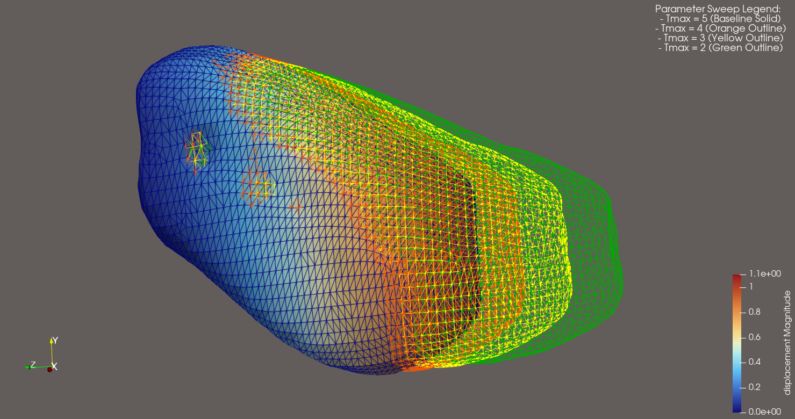

# Task 6: Monolithic Muscle Contraction - Parameter Sweeps

## 1. Objective
Investigate the effect of maximum isometric active tension ($T_{\max}$) on the axial Z-displacement and volumetric stability of a 3D continuum biceps muscle model. This study establishes a rigorous baseline dataset and implements an automated text-logging extraction pipeline to streamline multi-run sensitivity evaluations.

---

## 2. Technical Repository Architecture
To maintain professional reproducibility, the computational assets of this task are organized cleanly into functional subdirectories:
* **Primary Documentation:** [`README.md`](README.md) — Self-contained engineering report.
* **Automation Workflow:** [`plot_sweep.py`](plot_sweep.py) — Custom Python script using Pandas for parsing log headers and mapping transient contraction curves.
* **Input Decks:** [`feb_inputs/`](feb_inputs/) — Contains the structured FEBio boundary condition and material geometry XML files (e.g., `biceps-tmax5.feb`).
* **Text Streams & Diagnostics:** [`raw_logs/`](raw_logs/) — Relocated target directory isolating ASCII data outputs (`*_disp.txt`, `*_stress.txt`) and solver streams (`*.log`).
* **High-Fidelity Visualizations:** [`VTK_files/`](VTK_files/) — Exported time-series unstructured grid meshes (`*.vtu`) mapping continuum deformation states.

---

## 3. Methodology & Automated Logging Pipeline

### 3.1 Bypassing GUI Overhead
To execute multi-run studies efficiently without graphical interface dependencies, the baseline FEBio text input deck was appended with a native `<logfile>` tracking schema block within the `<Output>` architecture. This commands the core-solver to output isolated numerical arrays directly during the convergence loops.

[INSERT_XML_LOGFILE_BLOCK_HERE]

### 3.2 Tracked Kinematic & Constitutive Targets
1. **Global Contraction Tracker (Node 1773):** Positioned at the unconstrained tendon boundary to capture true axial displacement ($u_z$) over time.
2. **Local Tissue Integrity Tracker (Element 12457):** Positioned inside the center of the active muscle belly to monitor normal axial stress ($\sigma_z$) and the volume ratio ($J$). 

The volume ratio is defined mathematically via the determinant of the deformation gradient tensor $\mathbf{F}$:
$$J = \det \mathbf{F} = \frac{V}{V_0}$$

**Tracking Coordinate Reference:**

---

## 4. Baseline Simulation Visualizations

A high-fidelity visualization strategy was developed using ParaView to explicitly illustrate the structural contraction gradients. 

### 4.1 Displacement Shape Interpolation
Below is the baseline spatial transformation. By extracting the initial step ($t=0$) as a static wireframe reference shell (rendered at $30\%$ opacity), we capture a clear visualization of the muscle belly pulling away inward as the transient mesh reaches full displacement ($t=1.0$).

*Baseline kinematic structural transformation at t=1.0 relative to the undeformed t=0 geometry (rendered as a 30% opacity wireframe). Note: The deformed state utilizes a 'Warp By Vector' filter (Scale Factor = 5.0) to visually amplify the contraction profile.*

### 4.2 Quantitative Transient Tracking
By capturing specific point markers natively over time across all simulation states, the following multi-view workspace layout tracks the explicit acceleration profile of the tendon interface alongside its physical displacement spatial domain.

---

## 5. Initial Sensitivity Study ($T_{\max}$ Exploratory Sweep)

### 5.1 Multi-Surface Deformation Overlay
To visually distinguish the progression of muscle contraction across the exploratory spectrum ($T_{\max} \in \{2, 3, 4, 5\}$), a multi-layer outline visualization was developed. The maximum deformation state ($T_{\max} = 5$) serves as the solid background anchor color-mapped to displacement magnitude, while the final contracted states of $T_{\max} = 2, 3,$ and $4$ are overlaid as uniform wireframe silhouettes.

To resolve the tightly grouped geometric transformations, an identical displacement scaling multiplier ($\text{Scale Factor} = 5.0$) was applied across all concurrent layers to amplify boundary separation.

*Multi-surface structural contraction progression across the parameter sweep. Note: A ParaView 'Warp By Vector' filter has been applied across all concurrent layers using an identical displacement magnification multiplier (Scale Factor = 5.0) to visually resolve the tightly grouped geometric transformations via the coordinate translation $\mathbf{x}_{\text{visual}} = \mathbf{x}_{\text{initial}} + (5.0 \times \mathbf{u})$.*

---

## 6. Quantitative Results & Diagnostic Analytics

The text logs autonomously extracted via the pipeline were processed using [`plot_sweep.py`](plot_sweep.py) to generate transient tracking curves mapping total displacement against simulation time frames.

*Quantitative transient tracking curves extracted via python parsing scripts, confirming the monotonic relationship between peak contraction velocity and isometric muscle capacity values.*

### 6.1 Key Findings & Validation
1. **Kinematic Response:** Higher isometric active tension limits correspond directly to greater final displacements at the unconstrained tendon boundary. The peak Z-displacement scales monotonically from $0.47\text{ mm}$ ($T_{\max} = 2$) up to $1.09\text{ mm}$ ($T_{\max} = 5$).
2. **Volumetric Mesh Stability:** At peak loading conditions ($T_{\max} = 5$), tracking data from the deep muscle belly (Element 12457) confirms that the volume ratio ($J$) stabilized at $0.9808$. Because muscle tissue behaves nearly incompressibly ($J \approx 1.0$), a volumetric compression bound under $2\%$ demonstrates that the continuum elements maintain excellent physical health without triggering localized volumetric locking.
3. **Activation Curve Limitations:** The transient displacement profiles exhibit an un-biomimetic linear acceleration slope instead of reaching a natural physical plateau. This behavior is directly caused by the continuous loading curve function defined inside the material configuration deck as `<math>t/20</math>`. This boundary constraint forces active internal fiber tension to scale infinitely over time.

---

## 7. Next Steps: Phase 2 Calibration
To transition this model into a realistic physiological simulation, the arbitrary parameter bounds explored in this baseline setup will be re-calibrated during Phase 2. This will involve:
* Transitioning the linear activation drive to a physiological step/activation function.
* Restructuring $T_{\max} = \text{variance}$ intervals based on established biomechanics literature to simulate target muscle health states (e.g., peak fiber recruitment vs. localized fatigue states).