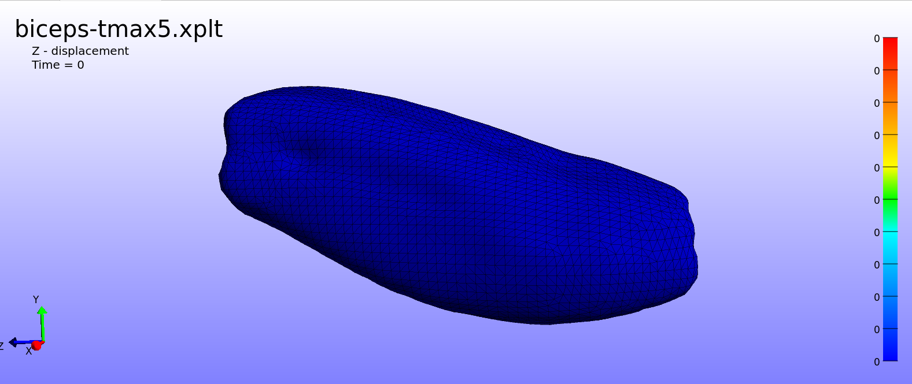
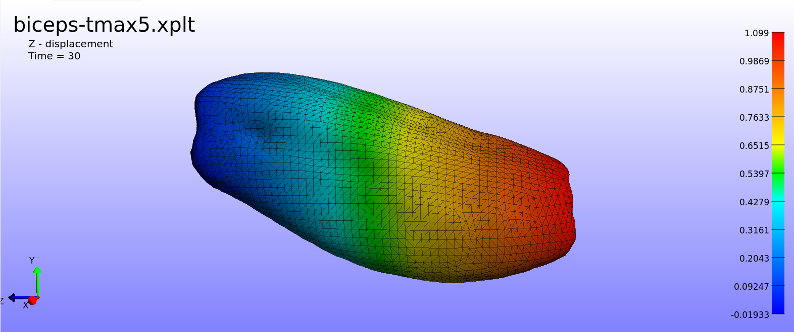

# Task 6: Monolithic Muscle Contraction - Parameter Sweeps

## 1. Objective
Investigate the effect of maximum isometric active tension ($T_{max}$) on the Z-displacement of a biceps muscle model using an automated extraction pipeline.

## 2. Methodology
* **Automated Extraction:** Bypassed the FEBioStudio GUI by modifying the baseline XML to include a `<logfile>` block. This automatically extracts the Z-displacement for Node 1773 and the Volume Ratio ($J$) for Element 12457.

**Extraction Node Location:**

* **Batch Execution:** Ran terminal simulations for $T_{max} \in \{2, 3, 4, 5\}$.
* **Data Visualization:** Built a custom Python/Pandas script (`plot_sweep.py`) to parse the FEBio text logs and plot comparative contraction curves.

## 3. Simulation Visuals
Below is the baseline 3D mesh ($t=0$) compared to the maximum deformation state at extreme tension ($T_{max} = 5$). 

**Baseline Geometry (t=0):**

**Maximum Deformation (T_max = 5, Final Timestep):**

## 4. Results & Displacement Curves

**Key Findings & Validation:**
1. **Displacement:** Higher $T_{max}$ yields greater Z-displacement (0.47mm to 1.09mm).
2. **Element Health:** At extreme tension ($T_{max} = 5$), the TET4 Volume Ratio ($J$) remained at 0.9809. This stays safely above the 0.95 threshold, indicating no volumetric locking occurred at this mesh density.
3. **Activation Curve Limitation:** As seen in the plot, the displacement does not reach a natural biological plateau. This is because the active contraction is driven by a continuous mathematical load curve defined as `<math>t/20</math>`. The artificial tension scales linearly forever. This will be corrected with a piecewise/step function during the Custom Geometry phase.
