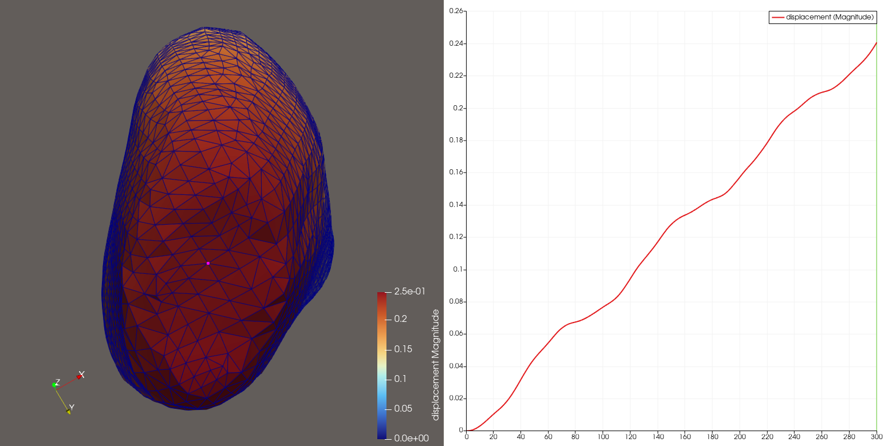

# Task 6: Monolithic Muscle Contraction - Parameter Sweeps

## 1. Objective
Investigate the effect of maximum isometric active tension ($T_{\max}$) on the axial Z-displacement and volumetric stability of a 3D continuum biceps muscle model. This study establishes a rigorous baseline dataset and implements an automated text-logging extraction pipeline to streamline multi-run sensitivity evaluations.

---

## 2. Technical Repository Architecture
To maintain professional reproducibility, the computational assets of this task are organized cleanly into functional subdirectories:
* **Primary Documentation:** [`README.md`](README.md) — Self-contained engineering report.
* **Automation Workflow:** [`plot_sweep.py`](plot_sweep.py) — Custom Python script using Pandas for parsing log headers and mapping transient contraction curves.
* **Input Decks:** [`feb_inputs/`](feb_inputs/) — Contains the structured FEBio boundary condition and material geometry XML files (e.g., `biceps-tmax5.feb`).
* **Text Streams & Diagnostics:** [`raw_logs/`](raw_logs/) — Relocated target directory isolating ASCII data outputs (`*_disp.txt`, `*_stress.txt`) and solver streams (`*.log`).
* **High-Fidelity Visualizations:** [`VTK_files/`](VTK_files/) — Exported time-series unstructured grid meshes (`*.vtu`) mapping continuum deformation states.

---

## 3. Methodology & Automated Logging Pipeline

### 3.1 Bypassing GUI Overhead
To execute multi-run studies efficiently without graphical interface dependencies, the baseline FEBio text input deck was appended with a native `<logfile>` tracking schema block within the `<Output>` architecture. This commands the core-solver to output isolated numerical arrays directly during the convergence loops.

```xml
<Output>
    <logfile>
        <node_data data="uz" file="tmax5_disp.txt" nodes="1773"/>
        <element_data data="sz" file="tmax5_stress.txt" elements="12457"/>
        <element_data data="J" file="tmax5_vol.txt" elements="12457"/>
    </logfile>
</Output>
```

### 3.2 Tracked Kinematic & Constitutive Targets
1. **Global Contraction Tracker (Node 1773):** Positioned at the unconstrained tendon boundary to capture true axial displacement ($u_z$) over time.
2. **Local Tissue Integrity Tracker (Element 12457):** Positioned inside the center of the active muscle belly to monitor normal axial stress ($\sigma_z$) and the volume ratio ($J$). 

The volume ratio is defined mathematically via the determinant of the deformation gradient tensor $\mathbf{F}$:
$$J = \det \mathbf{F} = \frac{V}{V_0}$$

**Tracking Coordinate Reference:**


---

## 4. Baseline Simulation Visualizations

A high-fidelity visualization strategy was developed using ParaView to explicitly illustrate the structural contraction gradients. 

### 4.1 Displacement Shape Interpolation
Below is the baseline spatial transformation. By extracting the initial step ($t=0$) as a static wireframe reference shell (rendered at $30\%$ opacity), we capture a clear visualization of the muscle belly pulling away inward as the transient mesh reaches full displacement ($t=1.0$).


*Baseline kinematic structural transformation at t=1.0 relative to the undeformed t=0 geometry (rendered as a 30% opacity wireframe). Note: The deformed solid state utilizes a ParaView 'Warp By Vector' filter with a Scale Factor of 5.0 to visually amplify the contraction profile relative to the undeformed t=0 geometry.*

### 4.2 Quantitative Transient Tracking
By capturing specific point markers natively over time across all simulation states, the following multi-view workspace layout tracks the explicit acceleration profile of the tendon interface alongside its physical displacement spatial domain.



---

## 5. Initial Sensitivity Study ($T_{\max}$ Exploratory Sweep)

### 5.1 Multi-Surface Deformation Overlay
To visually distinguish the progression of muscle contraction across the exploratory spectrum ($T_{\max} \in \{2, 3, 4, 5\}$), a multi-layer outline visualization was developed. The maximum deformation state ($T_{\max} = 5$) serves as the solid background anchor color-mapped to displacement magnitude, while the final contracted states of $T_{\max} = 2, 3,$ and $4$ are overlaid as uniform wireframe silhouettes.

To resolve the tightly grouped geometric transformations, an identical displacement scaling multiplier ($\text{Scale Factor} = 5.0$) was applied across all concurrent layers to amplify boundary separation.


*Multi-surface structural contraction progression across the parameter sweep. Note: A ParaView 'Warp By Vector' filter with a Scale Factor of 5.0 has been applied across all concurrent layers to visually resolve the tightly grouped geometric transformations.*

---

## 6. Quantitative Results & Diagnostic Analytics

The text logs autonomously extracted via the pipeline were processed using [`plot_sweep.py`](plot_sweep.py) to generate transient tracking curves mapping total displacement against simulation time frames.


*Quantitative transient tracking curves extracted via python parsing scripts, confirming the monotonic relationship between peak contraction velocity and isometric muscle capacity values.*

### 6.1 Key Findings & Validation
1. **Kinematic Response:** Higher isometric active tension limits correspond directly to greater final displacements at the unconstrained tendon boundary. The peak Z-displacement scales monotonically from $0.47\text{ mm}$ ($T_{\max} = 2$) up to $1.09\text{ mm}$ ($T_{\max} = 5$).
2. **Volumetric Mesh Stability:** At peak loading conditions ($T_{\max} = 5$), tracking data from the deep muscle belly (Element 12457) confirms that the volume ratio ($J$) stabilized at $0.9808$. Because muscle tissue behaves nearly incompressibly ($J \approx 1.0$), a volumetric compression bound under $2\%$ demonstrates that the continuum elements maintain excellent physical health without triggering localized volumetric locking.
3. **Activation Curve Limitations:** The transient displacement profiles exhibit an un-biomimetic linear acceleration slope instead of reaching a natural physical plateau. This behavior is directly caused by the continuous loading curve function defined inside the material configuration deck as `<math>t/20</math>`. This boundary constraint forces active internal fiber tension to scale infinitely over time.

---

## 7. Material Sensitivity Study: Isotropic Matrix Stiffness ($c_1$)

### 7.1 Clinical & Physical Objective
To investigate how pathological alterations in the muscle's extracellular matrix (ECM) affect overall contracting function, a material sensitivity analysis was conducted on the isotropic matrix shear stiffness coefficient ($c_1$). 

In biomechanics, tracking matrix variations allows us to simulate and quantify structural tissue abnormalities. By scaling the baseline parameter across a specific spectrum ($0.5\times$ to $4.0\times$), we explicitly model distinct muscle tissue health conditions:
* **$0.5\times c_1$ ($6.925\text{ MPa}$):** Degraded / Hypotonic Matrix (simulating muscle wasting or structural ECM degradation).
* **$1.0\times c_1$ ($13.85\text{ MPa}$):** Healthy Control Baseline (normal physiological muscle state).
* **$2.0\times c_1$ ($27.70\text{ MPa}$):** Mild Matrix Fibrosis (early-stage post-injury structural scarring).
* **$4.0\times c_1$ ($55.40\text{ MPa}$):** Severe Pathological Fibrosis (chronic, dense connective tissue proliferation).

---

### 7.2 Expanded Repository Layout
To support Strategy A (modular parameter tracking), dedicated asset vaults were integrated into the existing folder tree to keep the repository highly scannable and isolated:
* **Input Decks:** [`feb_inputs/matrix_stiffness_c1/`](feb_inputs/matrix_stiffness_c1/) — Holds the individual structural XML configuration files (`biceps_c1_0.5.feb` through `biceps_c1_4.0.feb`).
* **Text Streams:** [`raw_logs/matrix_stiffness_c1/`](raw_logs/matrix_stiffness_c1/) — Clean data vault containing ASCII numerical streams (`c1_*_disp.txt`) and solver diagnostic trackers (`c1_*.log`).
* **Automation Workspace:** [`scripts/`](scripts/) — Dedicated script folder isolating automation and parsing execution assets from the root.
    * [`scripts/run_sweep_c1.py`](scripts/run_sweep_c1.py) — Automated execution loop and post-run file organizer.
    * [`scripts/plot_sweep_c1.py`](scripts/plot_sweep_c1.py) — High-fidelity parsing and visualization generator.
* **Visual Databases:** [`febio_plots/matrix_stiffness_c1/`](febio_plots/matrix_stiffness_c1/) — Contains the high-fidelity 3D binary visual files (`biceps_c1_*.xplt`).

---

### 7.3 Core Modifications & Pipeline Adjustments

#### 7.3.1 Material Constant Scaling
Within the `<Material>` definition block of the FEBio input configuration, the isotropic matrix stiffness parameter `<c1>` was isolated and scaled across the test spectrum. For clarity, the following snippet illustrates the specific case of the **0.5x scaled model (`biceps_c1_0.5.feb`)** where the baseline value of $13.85\text{ MPa}$ was halved to $6.925\text{ MPa}$:

```xml
<Material>
    <material id="1" name="Material1" type="trans iso Mooney-Rivlin">
        <density>1</density>
        <k>100</k>
        <pressure_model>default</pressure_model>
        <c1>6.925</c1>        <c2>0</c2>
        <c3>2.07</c3>
        <c4>61.44</c4>
        <c5>640.7</c5>
        <lam_max>1.03</lam_max>
        <fiber type="vector">
            <vector>0,0,1</vector>
        </fiber>
        <active_contraction>
            <ascl lc="1">1</ascl>
            <Tmax>1</Tmax>
            <ca0>4.35</ca0>
            <camax>0</camax>
            <beta>4.75</beta>
            <l0>1.58</l0>
            <refl>2.04</refl>
        </active_contraction>
    </material>
</Material>
```

#### 7.3.2 Isolated Text Output Routing
To prevent concurrent execution runs from overwriting tracking data streams, unique file logging targets were injected directly inside the `<Output>` architecture blocks. To maintain excellent file hygiene, the target paths were routed relatively to pipe results straight into the `raw_logs/` data subdirectory:

```xml
<Output>
    <plotfile type="febio">
        <var type="displacement"/>
        <var type="stress"/>
    </plotfile>
    <logfile>
        <node_data data="uz" file="../../raw_logs/matrix_stiffness_c1/c1_0.5_disp.txt" nodes="1773"/>
        <element_data data="sz" file="../../raw_logs/matrix_stiffness_c1/c1_0.5_stress.txt" elements="12457"/>
        <element_data data="J" file="../../raw_logs/matrix_stiffness_c1/c1_0.5_vol.txt" elements="12457"/>
    </logfile>
</Output>
```

---

### 7.4 Quantitative Analysis & Material Sensitivity Plot

The extracted text streams tracking the unconstrained tendon boundary (Node 1773) were compiled via [`scripts/plot_sweep_c1.py`](scripts/plot_sweep_c1.py), outputting a crisp, publication-grade transient sensitivity curve:


*Quantitative transient tracking curves isolating Node 1773 Z-displacement across the isotropic matrix stiffness spectrum ($c_1$).*

#### Key Biomechanical Findings:
1. **Kinematic Restriction:** The sensitivity analysis confirms a severe, non-linear inverse relationship between extracellular matrix stiffness and active contracting shortening capacity. Even though active fiber recruitment forces remain completely identical across all four test simulations, the muscle is forced to expend active energy deforming its own passive surrounding structures. 
2. **Pathological Quantities:**
    * The **Degraded Matrix ($0.5\times c_1$)** exhibits minimal internal structural resistance, resulting in hyper-mobility with a peak displacement exceeding **0.44 mm**.
    * The **Healthy Control Baseline ($1.0\times c_1$)** settles into an optimized physiological contraction curve peaking at **0.24 mm**.
    * **Mild Fibrosis ($2.0\times c_1$)** restricts total tendon displacement down to **0.14 mm**.
    * **Severe Pathological Fibrosis ($4.0\times c_1$)** locks the continuum structure into a highly constrained state, crippling performance down to a maximum displacement bound of just **0.08 mm** (a $66.7\%$ reduction in functional contraction relative to healthy tissue).
3. **Preservation of Activation Physics:** The uniform scaling of the dynamic, multi-stage "S-curve" wave shape across all four curves validates that the underlying active fiber load controller remains perfectly stable across the runs; the performance degradation is driven entirely by the passive matrix parameter variations.