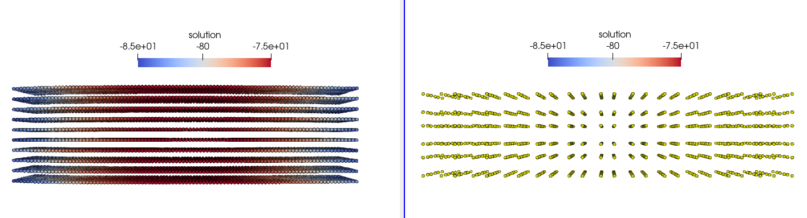

# Coupled fibers-mechanics simulation of a cuboid muscle

## How to run

- The fiber participant (OpenDiHu)

```
cd fibers-opendihu
mkorn && sr
./build_release/fibers settings_fibers.py
``` 

- The mechanics participant (0ption 1: OpenDiHu)

```
cd mechanics-opendihu
mkorn && sr
./build_release/muscle settings_muscle.py
``` 

- The mechanics participant (Option 2: OpenDiHu)

```
cd mechanics-febio
./run.sh cuboid-muscle.feb
```

## Muscle geometry

A cuboid with size 3 x 3 x 12 cm. 

## Mapping configuration

|  | **geometry (from muscle to fibers)** | **gamma (from fibers to muscle)** | Observations |
| --- | --- | --- | --- |
| **results1** | nearest-neighbour | nearest-neighbour | no contraction, fiber mesh looks wrong |
| **results2** | rbf (100, 0.2, 3) | nearest-neighbour | contracts |
| **results3** | nearest-neighbour (muscle: 1st) | nearest-neighbour | no contraction, fiber mesh looks wrong  |
| **results4** | nearest-neighbour (conservative) | nearest-neighbour | no contraction, fiber mesh looks wrong  |


on the left (fiber mesh looks as expected - results2) vs on the right (fiber mesh looks like the mechanics mesh)