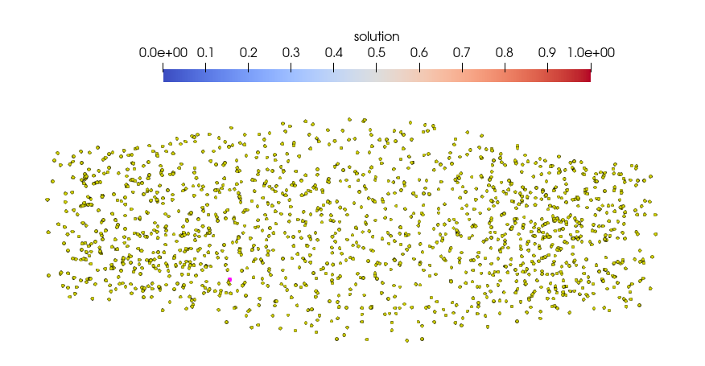

# Coupled fibers-mechanics of an ellipsoid muscle

## How to run

- The fiber participant (OpenDiHu)

```
cd fibers-opendihu
mkorn && sr
./build_release/fibers settings_fibers.py
``` 

- The mechanics participant (0ption 1: OpenDiHu)

```
cd mechanics-opendihu
mkorn && sr
./build_release/muscle settings_muscle.py
``` 

- The mechanics participant (Option 2: OpenDiHu)

```
cd mechanics-febio
./run.sh ellipsoid-muscle.feb
```

# Muscle geometry

The geometry is an ellipsoid like muscle with length 14 cm and a radius of 3cm at the center. 

The geometry is defined by

- `fibers_1.json` 
- `3D_mesh_1.vtk`


These geometry files were was generated using the geometry generation pipeline available on [our repository](https://github.com/carme-hp/muscle_prestretch_dataset/tree/main). To reproduce, use the following parameters:

```
id = 1
n_fibers = 40
nx = 5
ny = 5
nz = 21
L = 14
Rmax = 3
Rmin = 2
```

To parse the `3D_mesh_1.vtk` the script `read_structured_vtk.py` from our repository is provided.

## Mapping configuration

**Open Issue:** Why does nearest-neighbor mapping does not work for the geometry?

|  | **geometry (muscle to fibers)** | **gamma (fibers to muscle)** | Observations |
| --- | --- | --- | --- |
| **results1** | rbf (100, 0.2, 3) | rbf (100, 0.2, 3) |  |
| **results2** | rbf (default, 3) | rbf (default, 3) |  |
| **results3** | nearest-neighbour | nearest-neighbour | no contraction, fiber mesh looks wrong |
| **results4** | rbf (default, 3) | nearest-neighbour | no contraction, fiber mesh looks wrong |
| **results5** | nearest-neighbour | rbf (default, 3) |  |
| **results6** | nearest-neighbour, no initialization | nearest-neighbour | no contraction, fiber mesh looks wrong |

In the cases where there is no contraction, the fiber mesh in the openDihu solver looks like the 3D mesh. Despite looking like the 3D mesh, the fiber mesh still has 4040 points, and not 633 like the mechanics mesh. Multiple points (3-6) have the exact same coordinates.



The fiber simulation goes through despite the wrong mesh and nans everywhere. 