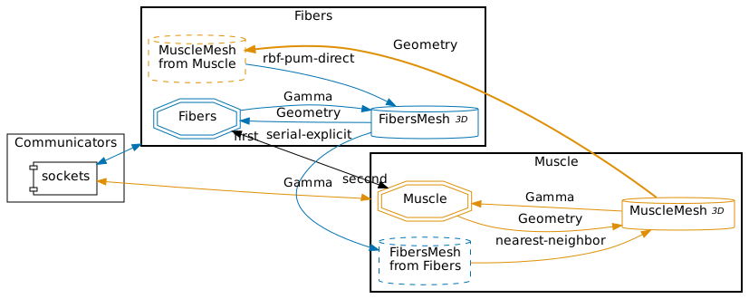
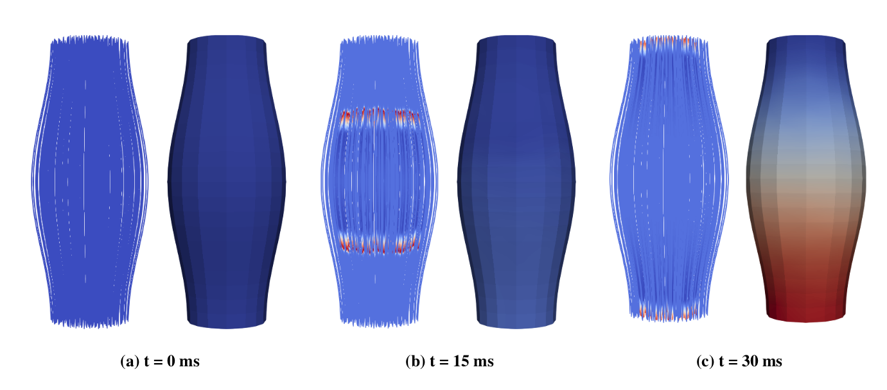

# Partitioned fusiform muscle

Here we provide the configuration files to run coupled simulations of contraction on an idealized artificial fusiform muscle. The muscle has a length of 14 cm with an initial maximum radius of 3 cm and a minimum radius of 2 cm. One end of the muscle is fixed, while the other is free to move, resulting in the muscle contraction. 

## 1. Running the coupled simulations

The simulations are based on the simultaneous run of two preCICE participants and take a few minutes to complete. Hence, two terminals are needed, one for the fibers participants and the other for the mechanics participants. For installation instructions on OpenDiHu we refer you to the official [documentation](https://opendihu.readthedocs.io/en/latest/). If you choose to run the mechanics participant using FEBio, then you will need to install both FEBio and the febio-adapter. Check out the [adapter repository](https://github.com/carme-hp/FEBio-adapter) for instructions. Furthermore, you have to install [preCICE](https://precice.org/) v3.

### 1.1 Running the fibers participant

The fibers participant is implemented and needs to be built with OpenDiHu first using `mkorn && sr`.

```
cd fibers-opendihu
mkorn && sr
./build_release/fibers settings_fibers.py
``` 

### 1.2 Running the mechanics participant

The mechanics participant is implemented both in OpenDiHu and in FEBio.

- Option 1: OpenDiHu

As in the fibers participant, build the solver before running using `mkorn && sr`.

```
cd mechanics-opendihu
mkorn && sr
./build_release/muscle settings_muscle.py
``` 

- Option 2: FEBio

For executing the FEBio solver, simply call the script `run.sh` with your desired input file:

```
cd mechanics-febio
./run.sh fusiform-muscle.feb
```

## 2. Selecting the mesh

To change the mesh used by an OpenDiHu participant, simply edit the `variables.py` file

```diff
- vtk_filename = "../meshes/3D_mesh_2x2x8.vtk"
+ vtk_filename = "../meshes/3D_mesh_4x4x16.vtk"
```

```diff
- fiber_file = "../meshes/fibers_fine.json"
+ fiber_file = "../meshes/fibers_coarse.json"
```

The folder `meshes` contains two options for the fibers mesh and 4 options for the mechanics mesh (structured grid only). If you chose the finest mechanics mesh (`3D_mesh_16x16x64.vtk`), OpenDiHu is
unable to run in serial and must be run in parallel:

```
mpirun -n 8 ./build_release/muscle settings_muscle.py
```

If you use FEBio for the mechanics participants, you can still use the structured meshes in this folder, but need to convert the files to unstructured .vtk format in order to import the mesh in FEBioStudio (see `convert2unstructured.py`). Moreover FEBio supports unstructured mesh. The default input file for FEBio, `fusiform-muscle-unstructured.feb`, includes an unstructured mesh was generated directly with FEBioStudio's *tet4* algorithm.


## 3. Selecting the coupling configuration

The coupling configuration is specified in the `precice-config.xml` file and can be visualized with the [preCICE config visualizer](tooling-config-visualization.html). 



In our case, the domains of the participants fully overlap, and the whole meshes must be mapped. The mesh of the mechanics participant (Muscle) is always coarser than the mesh of the fibers participant. 

The mapping is as follows:
- **From mechanics to fibers**: rbf mapping is needed.
- **From fibers to mechanics**: rbf mapping is optional, NN can be used. 


To change the configuration edit `precice-config.xml`:

```diff
  <participant name="Muscle">
    <provide-mesh name="MuscleMesh"/>
    <receive-mesh name="FibersMesh" from="Fibers"/>

    <read-data name="Gamma" mesh="MuscleMesh"/>
    <write-data name="Geometry" mesh="MuscleMesh"/>

-     <mapping:nearest-neighbor direction="read" from="FibersMesh" to="MuscleMesh" constraint="consistent" />
+     <mapping:rbf-pum-direct project-to-input="false" vertices-per-cluster="100" relative-overlap="0.2" constraint="consistent" direction="read" from="FibersMesh" to="MuscleMesh" >
+       <basis-function:compact-polynomial-c6 support-radius="3" />
+     </mapping:rbf-pum-direct>
  </participant>
```

## 4. Viewing the results

First, you can use the scripts `save_dihu_dihu.sh` and `save_febio_dihu.sh` to save the results for both participants in the same folder. The scripts will also take care of the preCICE export files if any. 

Results from FEBio in .xplt format can be opened in FEBioStudio and saved as .vtk files (it helps to select the series option).

The easiest way to look at the results is using ParaView.



## 5. Profiling the results

You can use the profiling tools from preCICE to analyze the results by running `merge` and `export`. Alternatively, run the script `process_precice_profiling.sh` to automatically generate the `.csv` files for multiple results folders. The scripts in the plotting folder extract and plot values from the `.csv` files.

